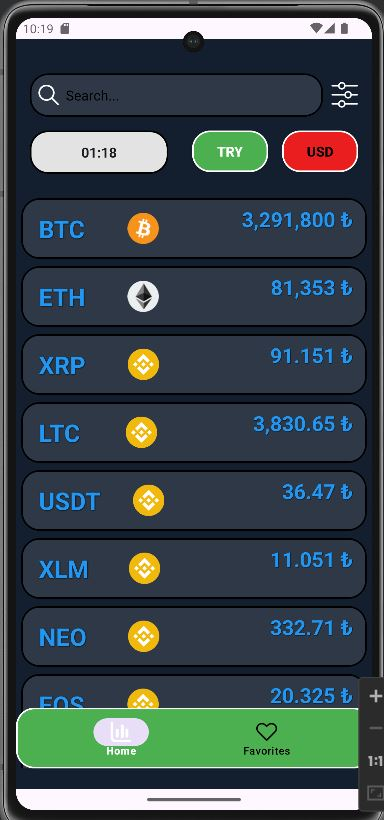
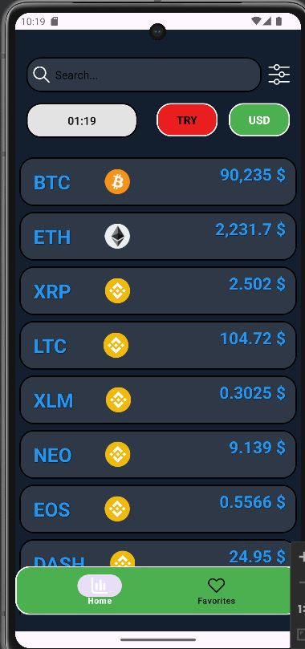
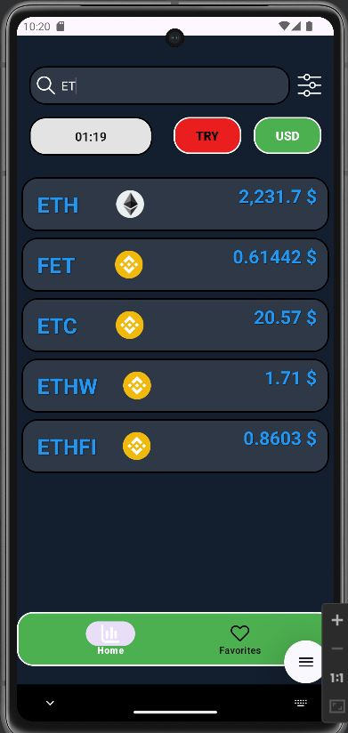
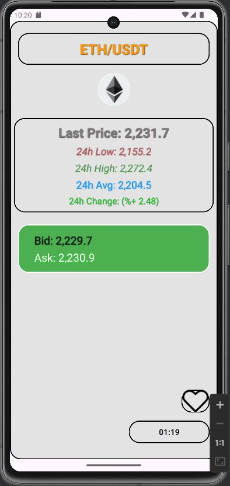
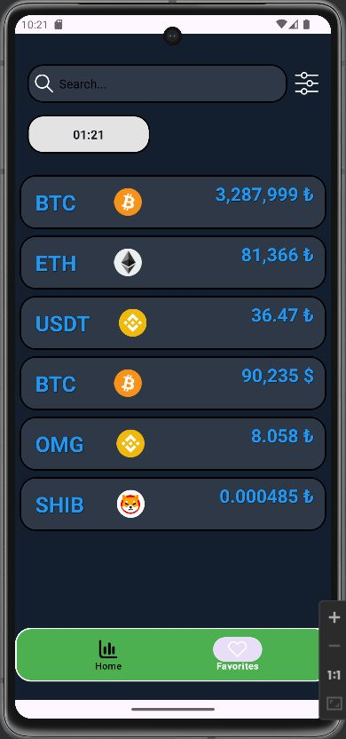
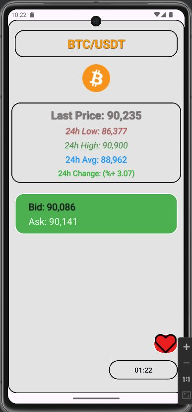

# Crypto Coin App Kotlin

Retrofit kullanarak BTC API'sinden kripto para verilerini çeken bir mobil uygulamadır. MVVM mimarisi, Dependency Injection, Room ve Retrofit teknolojileri kullanılarak geliştirilmiştir.

## Özellikler
- **Gerçek Zamanlı Kripto Para Verileri**: BTC API'sinden alınan güncel kripto para verilerini gösterir.
- **Filtreleme Seçenekleri**:
  - Türk Lirasına (TRY) göre filtreleme
  - USDT'ye göre filtreleme
- **Favorilere Ekleme & Çıkarma**: Kullanıcılar istedikleri kripto paraları favorilere ekleyebilir veya çıkarabilir.
- **Favorilerimi Görme**: Kullanıcı, favori kripto paralarını liste halinde görüntüleyebilir.
- **Room Veritabanı Desteği**: Favori verileri cihazda saklanır.
- **MVVM Mimari Yapısı**

## Kullanılan Teknolojiler
- **Kotlin**
- **MVVM (Model-View-ViewModel) Mimarisi**
- **Retrofit** (API bağlantıları için)
- **Dependency Injection**
- **Room Database** (Favori kripto paraların saklanması için)
- **LiveData ve ViewModel**

## Ekran Görüntüleri
Aşağıda uygulamanın bazı ekran görüntüleri bulunmaktadır:

  
  
  
  
  
 

